# Radio-Communication-using-NRF24L01-Transceiver
This repo will contain schematics, code and tips to achieve effective communication between NRF24 Transceiver and different microcontrollers such as ESP32 and NodeMCU

## Getting Started
### Downloading Arduino

If you haven't already, we'll start with downloading the Arduino IDE.
Make sure you have the latest version of the Arduino IDE installed in your computer.
<br>
If you don’t, uninstall it and install it again. Otherwise, it may not work.

Having the latest Arduino IDE software installed from [arduino.cc/en/Main/Software](https://www.arduino.cc/en/software), continue with this tutorial.

### Installing ESP32 Add-on in Arduino IDE

If you are not using the ESP32 or if you've already installed ESP32, you can skip this section.

To install the ESP32 board in your Arduino IDE, follow these next instructions:

1. In your Arduino IDE, go to  File > Preferences
<br>
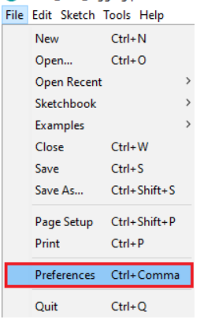

2. Enter the following into the “Additional Board Manager URLs” field:
```
https://raw.githubusercontent.com/espressif/arduino-esp32/gh-pages/package_esp32_index.json
```
Then, click the “OK” button:
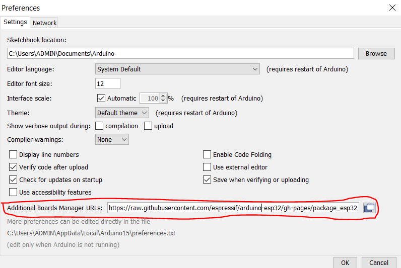

**Note**: if you already have the ESP8266 boards URL, you can separate the URLs with a comma as follows:
```
https://raw.githubusercontent.com/espressif/arduino-esp32/gh-pages/package_esp32_index.json, http://arduino.esp8266.com/stable/package_esp8266com_index.json
```

3. Open the Boards Manager. Go to Tools > Board > Boards Manager…

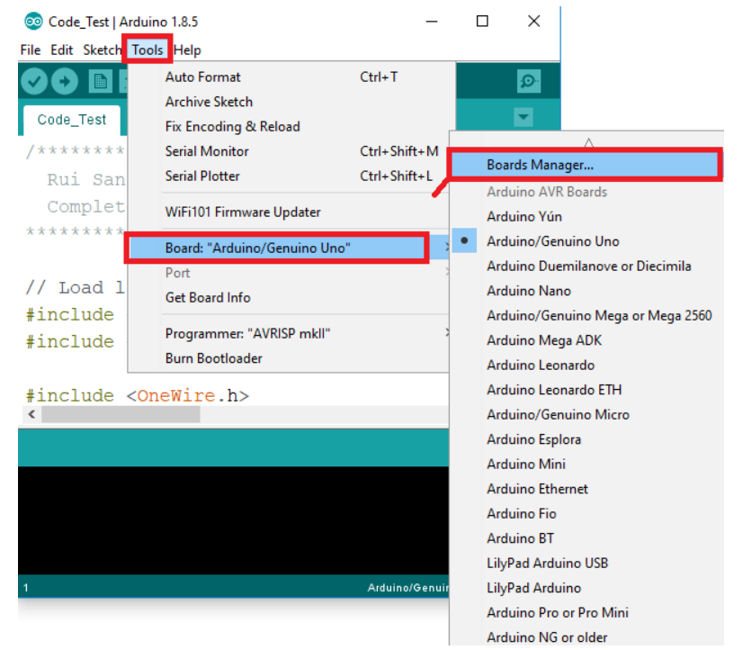

4. Search for ESP32 and press install button for the "ESP32 by Espressif Systems":

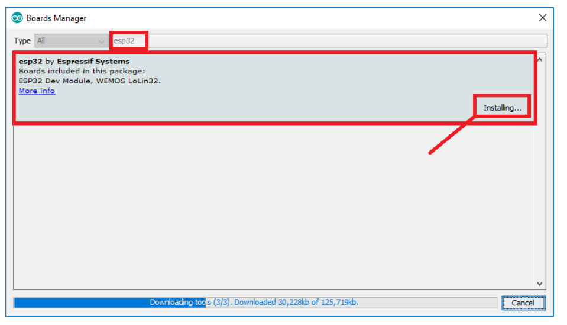

Give it some seconds or minutes to complete downloading all the required resources, depending on your internet connection.

5. Aaand... That’s it.😀

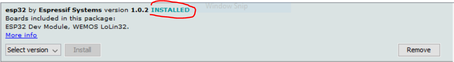

## Connection between ESP32-S(Nodemcu32S) and NRF24LO1-Transceiver

### ESP32-S Pinout

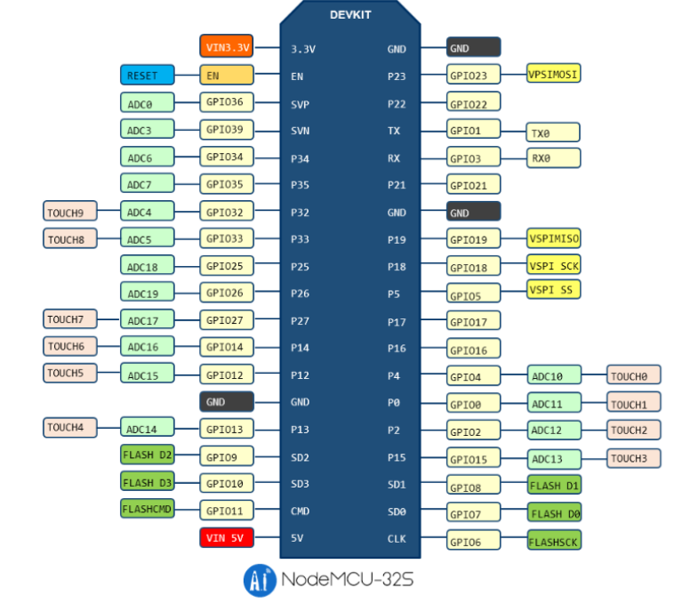

### NRF24LO1-Transceiver Pinout

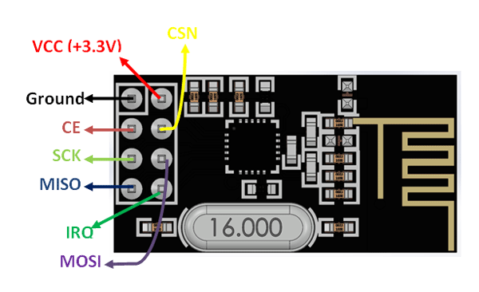

### Connections

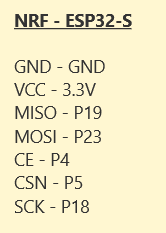

## Connection between ESP12E(Nodemcu v1) and NRF24LO1-Transceiver

### NodeMCU Pinout

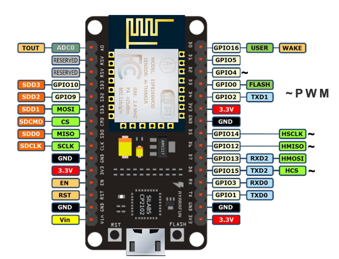

### NRF24LO1-Transceiver Pinout


### Connections

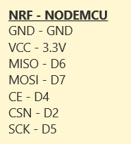

## Code
### Installing NRF Library
Once we connect the NRF24L01 modules to the Arduino boards we are ready to make the codes for both the transmitter and the receiver.

First we need to download and install the RF24 library which makes the programming less difficult. We can also install this library directly from the Arduino IDE Library Manager. Just search for “rf24” and find and install the one by “TMRh20, Avamander”.


### Transmitting Device

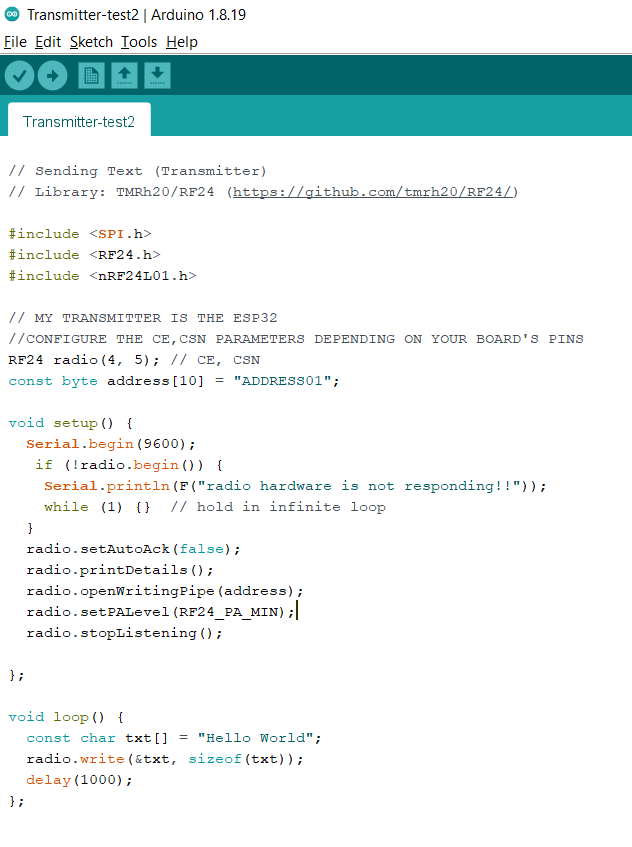
[Get code here](./Transmitter/Transmitter-test2/Transmitter-test2.ino)

### Receiving Device

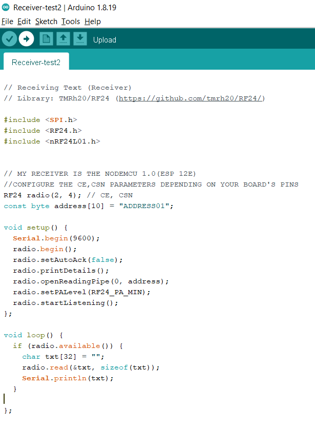
[Get code here](./Receiver/Receiver-test2/Receiver-test2.ino)

### Output
If everything has gone well (which I hope it did), you should see "Hello World" displayed in your Serial Monitor.